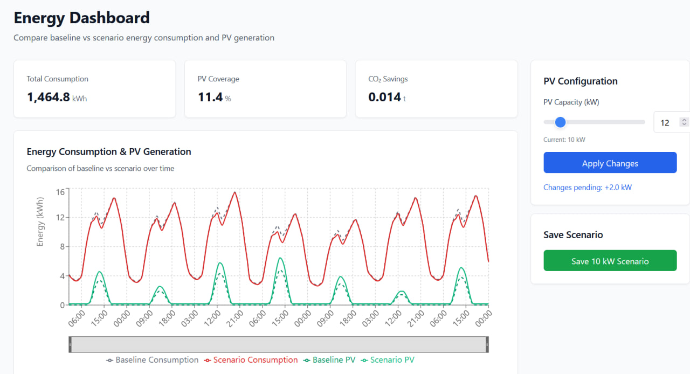

# Energy Dashboard – Scenario Comparison

A full-stack web application for visualising energy consumption and PV (photovoltaic) generation, with an interactive scenario configurator that lets you compare baseline vs. custom PV capacity setups in real time.

---

## Features

- **Time-series chart** — hourly baseline vs. scenario comparison for consumption and PV generation over a 7-day window, with a brush/zoom control
- **KPI cards** — live-recalculated total consumption (kWh), PV coverage (%), and CO₂ savings (t)
- **PV Configurator** — slider + numeric input (0–100 kW) to adjust PV capacity; changes are applied on demand
- **Save scenarios** — persist named scenarios via the API (in-memory, resets on restart); optimistic UI updates
- **Skeleton loading states & error boundaries** — graceful handling of slow or failed API calls

---

## Tech Stack

| Layer | Technology |
|---|---|
| Frontend | React 18, TypeScript, Vite, Tailwind CSS |
| Data fetching | TanStack Query (React Query) v5 |
| Charts | Recharts |
| Backend | Node.js, Express 4, TypeScript, tsx |
| ORM | Prisma 6 |
| Database | PostgreSQL 16 (via Docker) |

---

## Project Structure

├── mock-data/ # Seed JSON (7-day hourly dataset)
├── server/
│ ├── prisma/
│ │ ├── migrations/ # SQL migrations
│ │ ├── schema.prisma # Prisma schema
│ │ └── seed.ts # DB seeder
│ └── src/
│ ├── routes/
│ │ └── energy.ts # API routes
│ ├── lib/
│ │ └── prisma.ts # Prisma client singleton
│ └── index.ts # Express entry point
└── src/
├── api/
│ └── energyApi.ts # Fetch wrappers
├── components/ # React components
├── types/
│ └── energy.ts # Shared TypeScript types
└── utils/
└── calculateScenario.ts # PV scenario calculation logic

---

## API Reference

All endpoints are prefixed with `/api`.

| Method | Endpoint | Description |
|--------|----------|-------------|
| `GET` | `/health` | Health check |
| `GET` | `/api/energy` | Fetch the full energy dataset (timestamps, baseline, scenario, KPIs) |
| `GET` | `/api/energy/scenarios` | List all saved scenarios |
| `POST` | `/api/energy/scenarios` | Save a new scenario (`{ pvKw: number, kpis: object }`) |

---

## Scenario Calculation

The frontend calculates scenario values in `src/utils/calculateScenario.ts` using these assumptions:

| Constant | Value | Description |
|----------|-------|-------------|
| Peak sun hours | 4 h/day | Used to derive hourly additional PV |
| Self-consumption rate | 60% | Share of PV generation that offsets consumption |
| CO₂ factor | 0.4 kg/kWh | Grid emissions factor |

---

## Available Scripts

### Frontend (root)

| Script | Description |
|--------|-------------|
| `npm run dev` | Start Vite dev server |
| `npm run build` | Production build |
| `npm run preview` | Preview production build |

### Backend (`server/`)

| Script | Description |
|--------|-------------|
| `npm run dev` | Start API with hot reload (tsx watch) |
| `npm run build` | Compile TypeScript |
| `npm run db:migrate` | Apply Prisma migrations |
| `npm run db:seed` | Seed database from mock JSON |
| `npm run db:push` | Push schema without migrations (dev only) |

---

## Notes

- Saved scenarios are stored **in memory** on the server and reset on restart. Persisting them to the database is a natural next step.
- The seed script wipes existing `EnergyDataset` rows before inserting, so re-running it is safe.
- The Vite dev proxy is not configured — the frontend reads `window.location.origin` for API calls, so both servers must run on their default ports.

